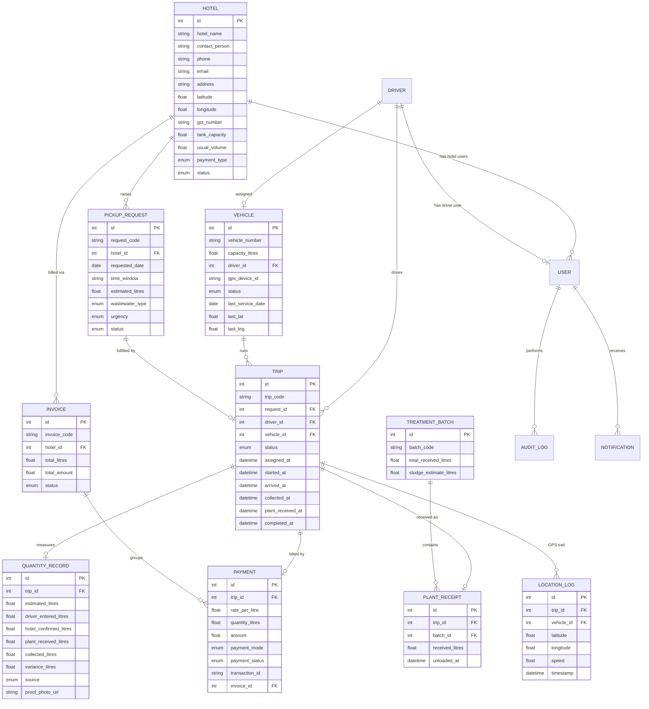

# Data model

Entities and fields follow spec sections 5 and 6. All models live in
`backend/app/models/` and share `created_at` / `updated_at` timestamps
(except append-only logs).

## Entity relationship diagram

## Enumerations

Defined once in `app/core/enums.py` and shared by models, schemas and the
workflow engine:

- **Role** — hotel, driver, admin, treatment
- **HotelStatus** — pending, active, suspended
- **VehicleStatus** — available, on_trip, maintenance, inactive
- **WastewaterType** — greywater, kitchen, mixed, blackwater, other
- **Urgency** — normal, high, urgent
- **RequestStatus** — requested → approved → assigned → in_progress → collected →
  received_at_plant → completed → invoiced → paid (+ cancelled)
- **TripStatus** — assigned → driver_started → reached_hotel → collection_started
  → collection_completed → moving_to_plant → reached_plant → unloaded → closed
  (+ cancelled)
- **PaymentMode** — cash, upi, bank_transfer, credit, monthly_invoice
- **PaymentStatus** — unpaid, partial, paid
- **InvoiceStatus** — draft, issued, paid, cancelled
- **QuantitySource** — manual, flowmeter, tank_level, photo, plant_confirmation
- **NotificationChannel** — push, sms, whatsapp, email

## Notes

- `request_code`, `trip_code`, `invoice_code`, `batch_code` are human-facing IDs
  (`REQ-2026-000001`, etc.) generated in `services/codes.py`, alongside the
  integer primary keys.
- `QuantityRecord` stores the four independent readings the spec calls for
  (driver, hotel, plant, and the reconciled `collected_litres`) plus a computed
  `variance_litres` — this is the billing and transparency source of truth.
- `AuditLog` and `LocationLog` are append-only (no `updated_at`).
