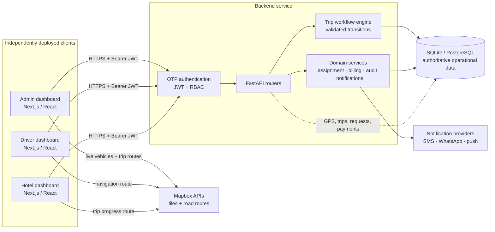
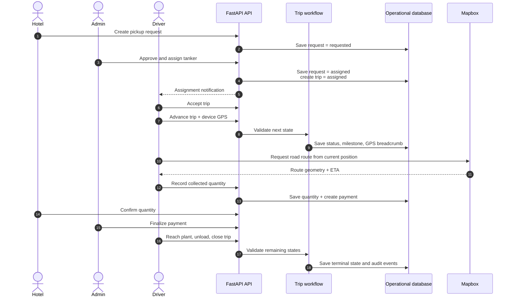
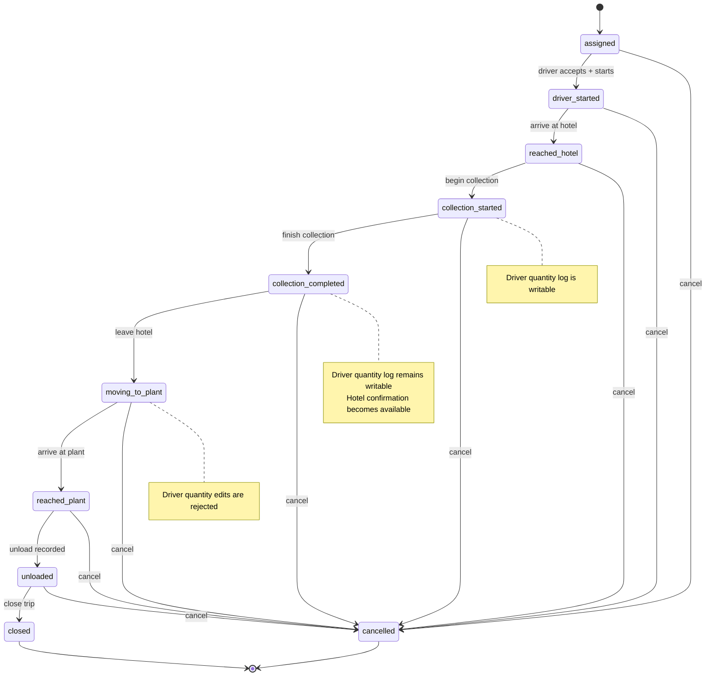
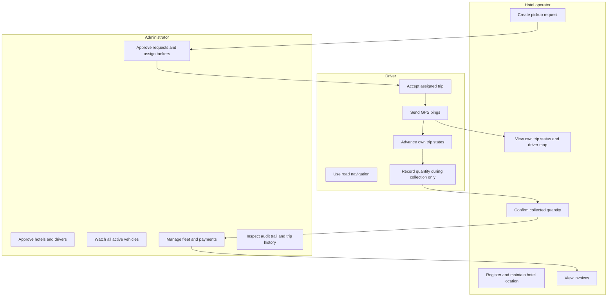
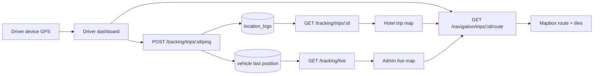
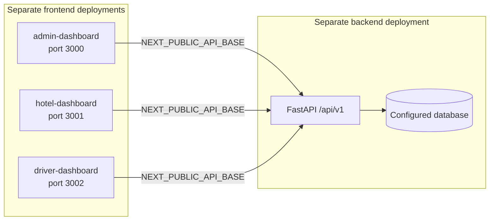

# Squas Cluster Connect diagrams

This page is the visual index for the three independently deployed dashboards,
the FastAPI service, and the trip data lifecycle. The diagrams use Mermaid so
they render in GitHub, GitLab, and compatible Markdown documentation systems.

## System architecture

Each dashboard is built and deployed independently. They share API contracts,
workflow rules, and visual conventions, but do not share a runtime bundle.

## End-to-end pickup sequence

## Trip state machine

The backend is authoritative: the UI hides unavailable actions, but every
transition and quantity write is enforced server-side.

## Role responsibilities

## Live location and map data flow

## Deployment boundaries

